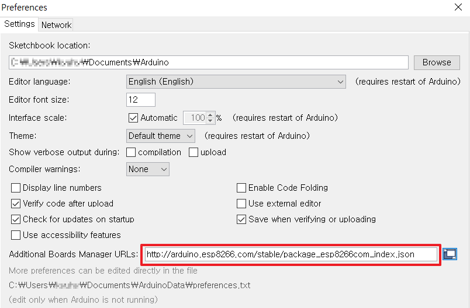
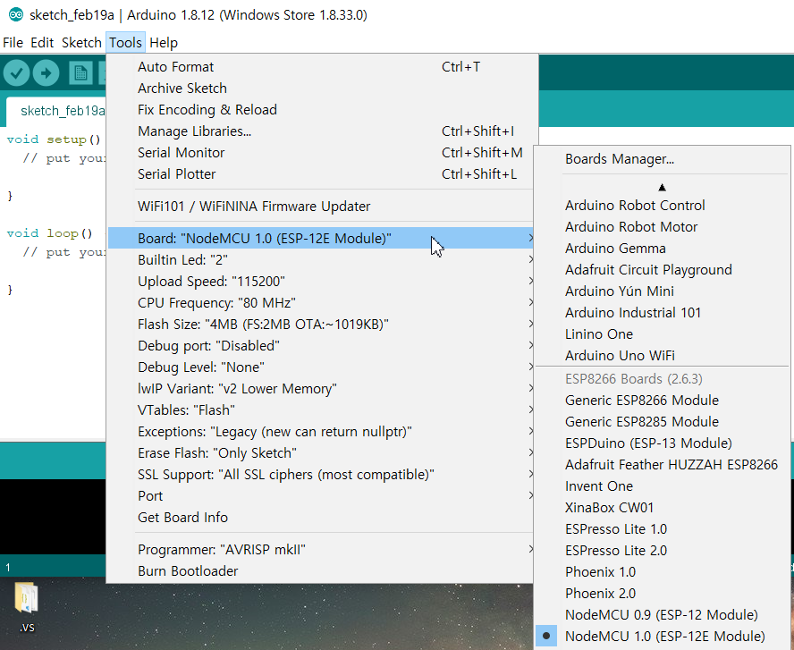
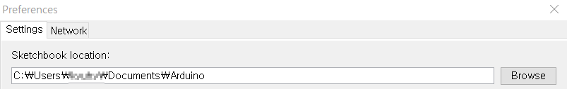
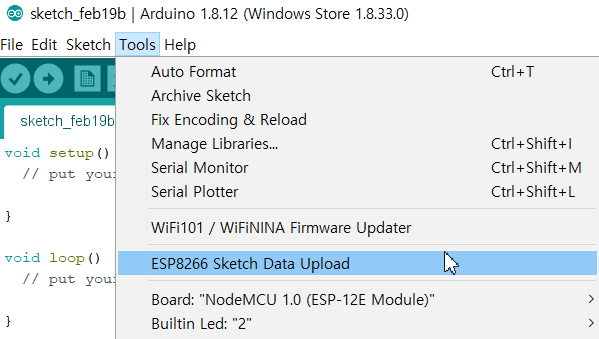
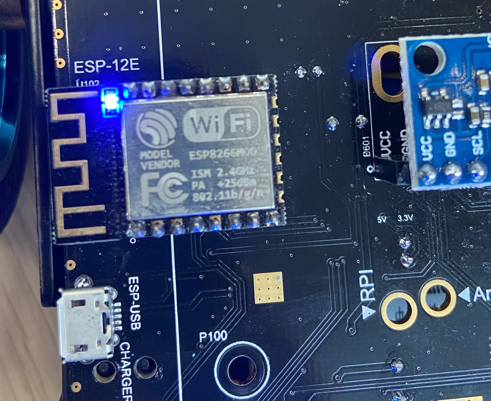
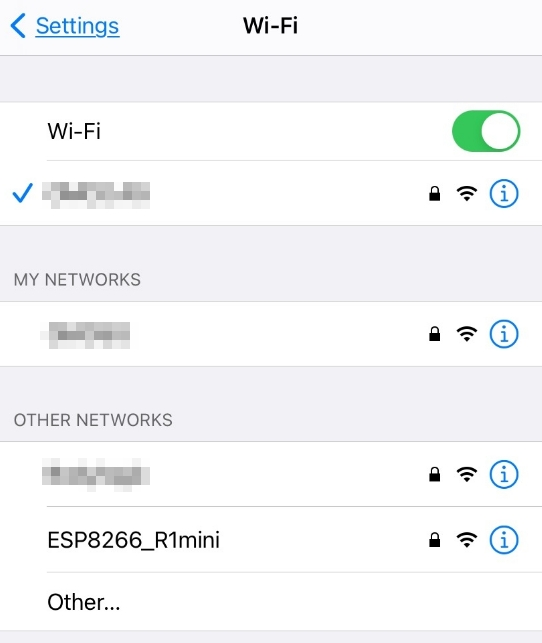
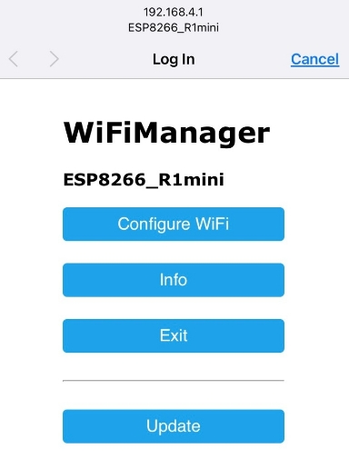
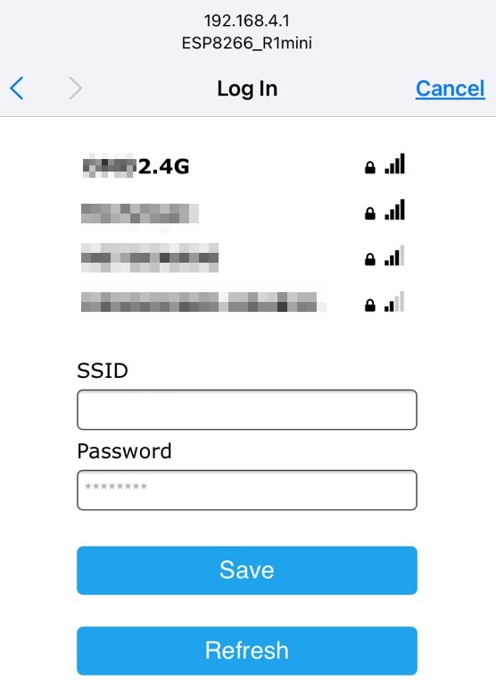
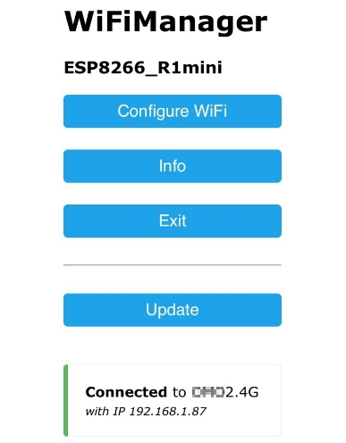

# ESP8266 based web controller for R1mini

한국어 문서는 [다음](README_KR.md) 를 참조하십시오.  
For Korean, refer to [README_KR](README_KR.md) document.  

## Introduction
[R1mini](https://www.omorobot.com/omo-r1mini "R1mini") is a smaller sized mobile robot platform from omorobot.com and is equipped with ESP8266 module so that you can upload your own arduino sketch and control the robot directly from the board.

This repsitory demonstrate how to connect the onboard ESP8266 board to a 2.4GHz wifi router and open a web server for user to send control message to the robot.

Below video shows how it works when you upload this sketch to the board.
[](https://www.youtube.com/watch?v=ax5wqK-Vj8c)


## Requirements

- R1mini platform: You can order from [omorobot](https://www.omorobot.com "OMOROBOT INC")
- Any PC with Arduino IDE installed: You can download from [here](https://www.arduino.cc/en/main/software "here")
- Any wifi router that supports 2.4GHz signal

## Setting up Arduino

### Add esp8266 board

1. In the top menu, go to File -> Preferences and find **Additional Boards Manager URLs** to enter https://arduino.esp8266.com/stable/package_esp8266com_index.json 
<div align="center">
  
</div>
  Press OK to save the settings.  

2. To add boards, go to Tools > Board: > Boards Manager...  and try to find esp8266 then press install button in the bottom right corner as below picture.
<div align="center">
  
</div>

3. Among boards in Tools > Board: menu, select NodeMCU 1.0 (ESP-12E Module) as shown below picture.
<div align="center">
  
</div>

### Additional Libraries

Following additional libraries are required to build the source.  

 - [Wifi manager](https://github.com/kentaylor/WiFiManager/) for connecting to WiFi router  
  If following error message occurs, change HTTP_HEAD to HTTP_HEADER in any occcurance in WiFiManager.h WifiManager.cpp file
```
/Users/Sid/Documents/Arduino/libraries/WIFIMANAGER-ESP32-master/WiFiManager.h:36:22: error: 'const char HTTP_HEAD []' redeclared as different kind of symbol
```
 - [Arduino WebSocket](https://github.com/Links2004/arduinoWebSockets) for web socket communication.  
 - [Arduino Json](https://github.com/bblanchon/ArduinoJson) for parsing Json format message


### Install esp8266 filesystem uploader

This package contains script files such as .js, .html and they cannot be uploaded by sketch upload from Arduino IDE 

1. Visit below link
https://github.com/esp8266/arduino-esp8266fs-plugin/releases/tag/0.5.0
and download a zip file containing all the tools and scripts.

2. Unzip the file will make folder named ESP8266FS and copy this folder into 'tools' folder under Arduino sketchbook folder. 
You can check the sketchbook folder in File > Preferences 
<div align="center">
  
</div>

3. Restart Arduino and you can find "ESP8266 Sketch Data Upload" under Tools menu
<div align="center">
  
</div>

## Uploading the sketch

## How to connect to a new WiFi router

### Change to AP mode
1. Power on the robot.  

2. <a name="B2"></a>Press **D1** button and hold until **onboard** Blue LED turn on.]
  <div align="center">
    
  </div>

3. If onboard Blue LED turned on, release **D1** button.  

4. The board will start AP mode with SSID "**ESP8266_R1mini**" and password as "**password**"  

5. Try to find wifi AP with above info and connect.  
  <div align="center">
    
  </div>

6. A webpage will open automatically or enter 192.168.4.1 to enter configuration page.  
  <div align="center">
    
  </div>

7. Select Configuration and find SSID of the router you want to connect.
    Note, only wifi with 2.4GHz works with ESP board.  
  <div align="center">
    
  </div>
    Enter the password configured in the router and press SAVE button.  

8. Wait for a while and the blue LED will be turned off. If eveything setup correctly, you can check IP address assigned to the ESP board by repeating [2.](#B2) and connect to ESP8266_R1mini again and remember this IP address.  
  <div align="center">
    
  </div>

9. Press Exit and disconnect from ESP board.  

10. Connect your smartphone or tablet to the router.  

11. Open up a browser and enter the IP address you just checked from ESP board.  

12. Enjoy the robot.  
