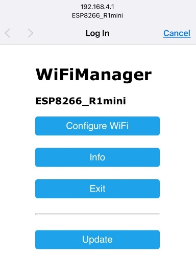
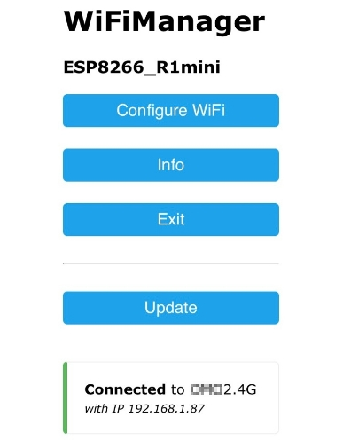

# ESP8266 웹 기반 R1-mini 제어

## 소개
[R1-mini](https://www.omorobot.com/omo-r1mini "R1-mini") 는 오모로봇이 만든 소형 자율주행 로봇 플랫폼입니다.  

이 로봇 플랫폼에는 WiFi가 내장된 ESP-12E/F 모듈이 장착되어 arduino IDE로 작성된 스케치를 빌드/업로드하여 제어할 수 있습니다.  

본 프로젝트는 R1-mini에 내장된 ESP32 보드를 통해 WiFi 라우터에 접속하여 웹 서버를 열고 브라우저를 통해 접근한 사용자의 입력을 로봇에 전달하는 데모 프로그램입니다.  

이 프로그램을 통해 사용자는  

- 로봇을 원격으로 제어하거나,  
<div align="center">
 
</div>

- 로봇의 RGB LED 의 색상을 변경하거나 헤드라이트 LED를 켜고 끌 수 있습니다.  

<div align="center">
 
 
</div>

## 준비물

- R1-mini 플랫폼: 오모로봇 홈페이지를 통해 구매하실 수 있습니다.
- 아듀이노 IDE가 설치된 PC - 아듀이노는 [다음](https://www.arduino.cc/en/main/software "here")에서 다운로드할 수 있습니다.
- 2.4기가 주파수를 지원하는 WiFi 라우터

## 아듀이노 설정

### esp8266 보드 추가하기

1. 상단 메뉴에서 파일 -> 환경설정 항목을 열고 **추가적인 보드 매니저 URLs** 항목에 https://arduino.esp8266.com/stable/package_esp8266com_index.json 을 추가합니다.
<div align="center">
  
</div>
확인을 눌러 설정을 저장합니다.  

2. 보드를 추가하기 위해서는 툴 -> 보드: > 보드 매니저... 를 열어 esp8266 를 검색하고 아래 그림과 같이 우측 하단의 설치 버튼을 눌러 설치합니다.  
<div align="center">
  
</div>

3. 툴 -> 보드: 메뉴에서, NodeMCU 1.0 (ESP-12E Module) 을 선택합니다.
<div align="center">
  
</div>

### 프로젝트 다운로드

Arduino 스케치 폴더에 이 프로젝트를 다운로드하거나 스케치 폴더 안에서 git bash를 열어 다음을 수행합니다.
```
git clone https://github.com/omorobot/r1mini_espControl.git
```

### 필요한 라이브러리

소스를 빌드하기 위해서는 다음의 추가적인 라이브러리들이 필요합니다.

 - [Wifi manager](https://github.com/kentaylor/WiFiManager/)는 WiFi 라우터에 접속하고 AP모드 설정을 위한 관리자 모듈입니다. 서브모듈로서 가져오기 위해 다음을 수행합니다.  
 ```
  cd r1mini_espControl
  git submodule update --init --recursive
 ```

  https://github.com/kentaylor/WiFiManager/ 에서 라이브러리를 직접 복사하는 경우 다음과 같은 에러 메세지가 발생하게 되면 WiFiManager.h WifiManager.cpp 파일에 있는 HTTP_HEAD 항목을 HTTP_HEADER 로 변경합니다.  
```
/Users/Sid/Documents/Arduino/libraries/WIFIMANAGER-ESP32-master/WiFiManager.h:36:22: error: 'const char HTTP_HEAD []' redeclared as different kind of symbol
```

 - 웹 소켓 통신을 위한 라이브러리 [Arduino WebSocket](https://github.com/Links2004/arduinoWebSockets)  
 - Json 포맷을 파싱하기 위한 라이브러리 [Arduino Json](https://github.com/bblanchon/ArduinoJson)  


### esp8266 파일시스템 업로더 설치

/data 폴더 안에는 웹서버를 열고 사용자 입력을 받기 위한 .html, .js 그리고 .css 파일등이 존재합니다.  
이 파일을 ESP8266 모듈의 플래시 영역에 업로드하기 위헤 다음을 수행합니다.  

1. 다음 [링크](https://github.com/esp8266/arduino-esp8266fs-plugin/releases/tag/0.5.0 "FS uploader") 에서 zip 파일을 다운로드합니다.  

2. 압축을 풀고 나온 ESP8266FS 폴더를 아듀이노의 스케치북 폴더 안에 'tools' 폴더에 복사합니다.  
스케치북 폴더는 아듀이노 IDE의 파일 -> 환경설정 메뉴에서 확인할 수 있습니다.  

<div align="center">
  
</div>

3. 아듀이노 IDE를 재시작한 다음 툴 메뉴에서 "ESP8266 Sketch Data Upload" 항목을 확인합니다.  
<div align="center">
  
</div>

## 스케치 업로드 하기

처음으로 빌드가 성공하게되면 먼저 data 폴더 안의 파일을 업로드하기 위해 툴->"ESP8266 Sketch Data Upload" 를 선택하여 파일을 업로드합니다.  

다시 툴->포트 번호를 선택하고 상단 메뉴의 Upload 버튼을 눌러 코드를 업로드합니다.  

## 새로운 WiFi 라우터에 접속하기

### AP 모드로 변경하기

만약 내부에 아무런 설정이 없는 경우 자동으로 AP 모드로 접속하게 됩니다.  
ESP32 모듈에 할당된 IP를 모르는 경우 다음을 수행하여 AP 모드로 변경하여 내부 IP 주소를 확인할 수 있습니다.  

1. 로봇을 켭니다.  

2. **D1** 버튼을 누른 후 ESP32 **내장LED** 가 켜질때까지 기다립니다.  
    <div align="center">
      
    </div>

3. 내장된 파란 LED가 켜지면 **D1** 버튼을 뗍니다.  


4. 이제 보드는 SSID 가 "**ESP8266_R1mini**" 이고 패스워드가 "**password**" 인 AP로 전환됩니다.  

5. 스마트폰 혹은 태블릿의 WiFi 설정을 열어서  설정된 AP를 찾아서 접속합니다.  
    <div align="center">
      
    </div>  


6. 성공적으로 접속하게되면 설정 페이지가 자동으로 뜹니다. 또는 브라우저에서 192.168.4.1 로 접속을 시도합니다.  
    <div align="center">
      
    </div>


7. Configure WiFi 버튼을 누르고 접속하고자 하는 라우터의 SSID 를 선택하고 비밀번호를 **SAVE** 버튼을 누릅니다.  
  주의, 2.4기가 WiFi만 접속 가능합니다.  
  <div align="center">
    
  </div>  


8. 잠시 기다리면 파란색 LED가 꺼지고 동작을 시작합니다. 이제 보드에 할당된 IP주소를 확인하기 위해 3번 항목을 다시 수행하여 ESP8266_R1mini에 접속하여 라우터에서 할당받은 IP주소를 확인합니다.  
  주의, IP 주소는 라우터에 접속할때마다 변경될 수 있습니다.  
  <div align="center">
    
  </div>


9. Exit 버튼을 눌러 접속을 해재합니다.  

10. 이제 휴대폰의 WiFi설정을 열어서 라우터에 접속합니다.  

11. 브라우저를 열고 ESP32모듈에 할당된 IP주소를 입력하여 로봇에 접속합니다.  

12. 로봇을 가지고 놉니다.


